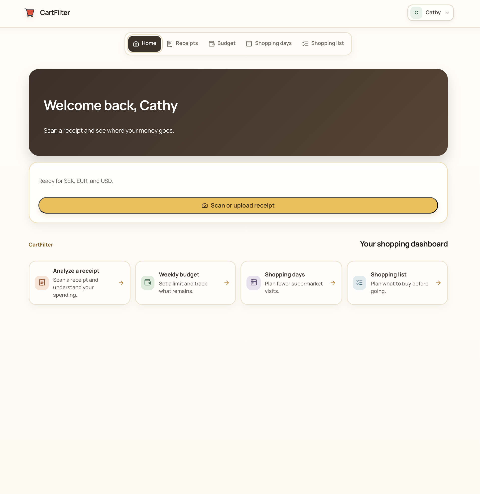
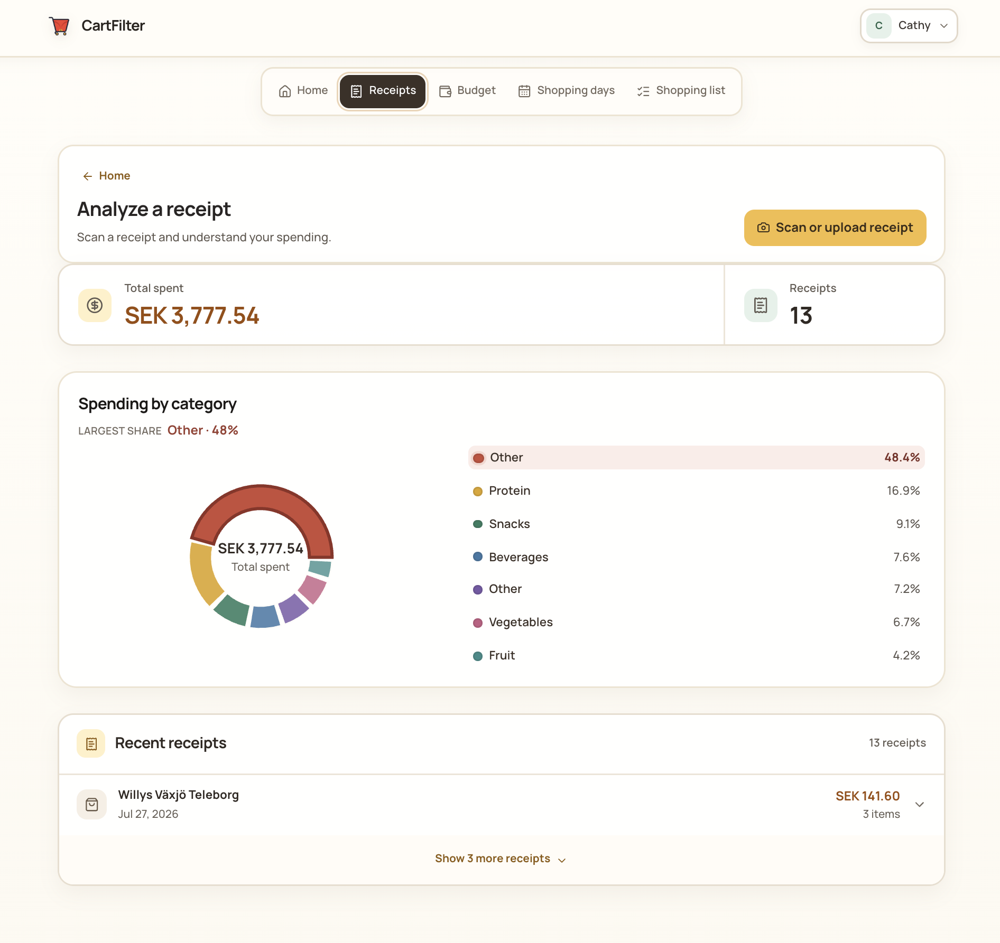
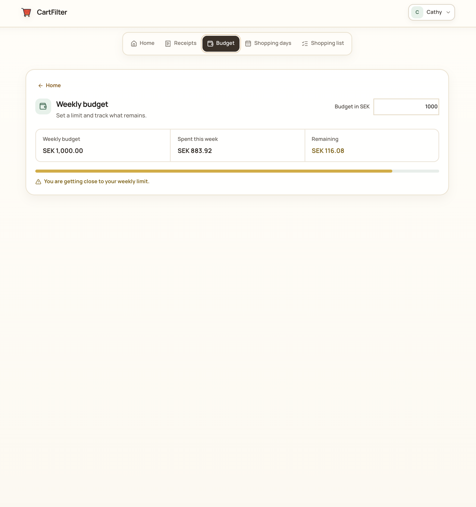
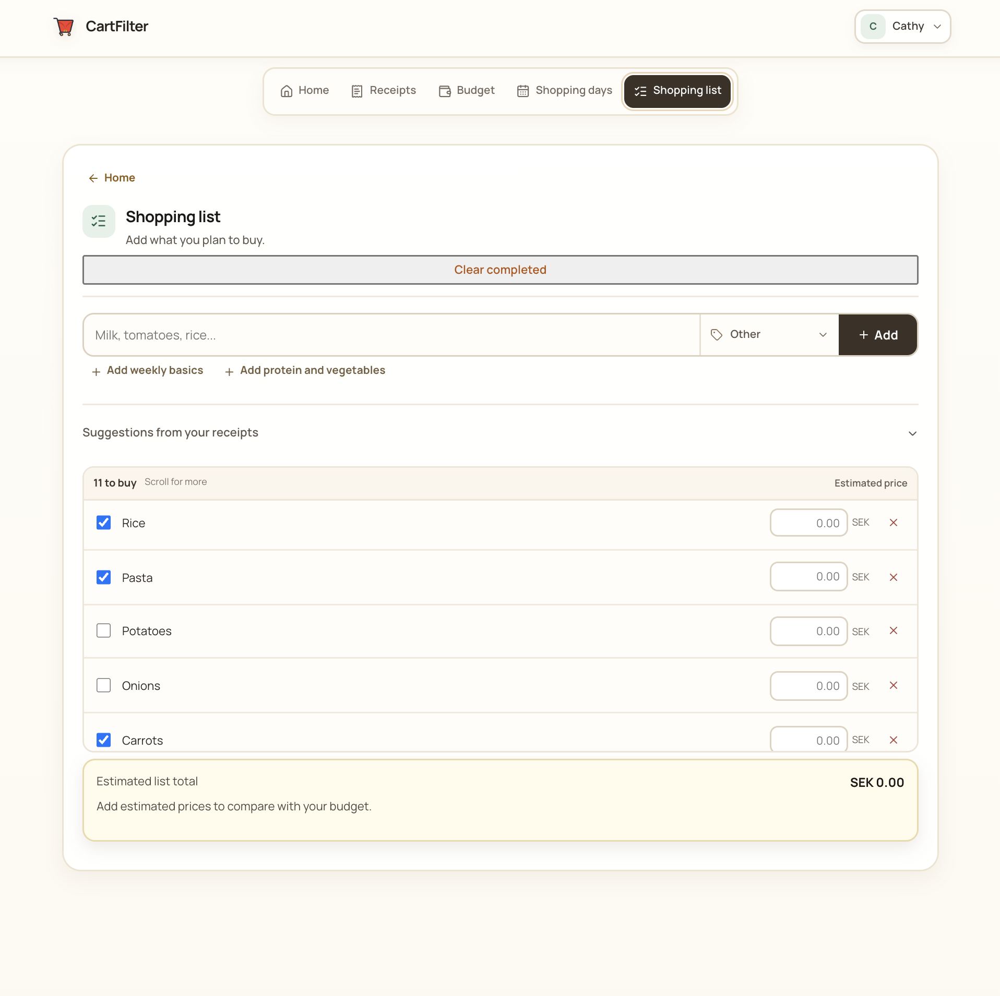

# CartFilter

**Understand grocery spending. Plan before shopping. Stay within budget.**

CartFilter is a responsive grocery budgeting application built with React and
Firebase. It converts receipt images into editable spending records, groups
purchases by category, and connects those insights with a weekly budget,
shopping-day goal, and reusable shopping list.

## Features

- **Receipt analysis** with local OCR for Swedish and English receipts
- **Manual review** for correcting item names, quantities, prices, totals, and
  categories before saving
- **Spending insights** with category percentages, recent receipts, and the
  largest spending category
- **Weekly budgeting** with spent, remaining, and progress status
- **Shopping-day planning** based on unique supermarket days each week
- **Shopping lists** with receipt suggestions and estimated-price comparison
- **Category learning** that remembers each user's corrections
- **Duplicate protection** to prevent the same receipt from being saved twice
- **Multiple currencies** with SEK, EUR, and USD display
- **Responsive design** for phones, tablets, and laptops
- **Cloud synchronization** through Firebase Authentication and Firestore

## Preview

<table>
<tr>
<td align="center" width="50%">
<strong>1. Home Dashboard</strong><br><br>

</td>
<td align="center" width="50%">
<strong>2. Receipt Insights</strong><br><br>

</td>
</tr>
<tr>
<td align="center" width="50%">
<strong>3. Weekly Budget</strong><br><br>

</td>
<td align="center" width="50%">
<strong>4. Shopping List</strong><br><br>

</td>
</tr>
</table>

## How It Works

1. Sign in with Google.
2. Upload a receipt file or take a photo.
3. Review the detected store, date, items, categories, and total.
4. Correct uncertain information and save the receipt.
5. Use the results to monitor spending, plan shopping days, and prepare a list.

If a receipt cannot be read reliably, the user can enter or correct its items
manually instead of abandoning the process.

## Supported Receipt Files

- JPG and JPEG
- PNG
- WebP
- BMP
- GIF
- AVIF
- HEIC and HEIF
- PDF

PDF processing is limited to the first five pages. Source files must be smaller
than 10 MB. Receipt images saved to Firebase are compressed and restricted by
the Storage security rules.

## Tech Stack

- React 19
- Create React App
- JavaScript
- CSS
- Firebase Authentication
- Cloud Firestore
- Firebase Storage
- Tesseract.js
- PDF.js
- heic2any
- Recharts
- Lucide React
- React Testing Library

## Getting Started

### Requirements

- Node.js 18 or newer
- npm
- A Firebase project with a registered web application

### Installation

```bash
git clone https://github.com/Cathy-5/CartFilter.git
cd CartFilter
npm install
```

Create `.env.local` in the project root:

```env
REACT_APP_FIREBASE_API_KEY=your_api_key
REACT_APP_FIREBASE_AUTH_DOMAIN=your_auth_domain
REACT_APP_FIREBASE_PROJECT_ID=your_project_id
REACT_APP_FIREBASE_STORAGE_BUCKET=your_storage_bucket
REACT_APP_FIREBASE_MESSAGING_SENDER_ID=your_sender_id
REACT_APP_FIREBASE_APP_ID=your_app_id
```

A Firebase Analytics measurement ID is not required by the current
implementation.

### Firebase Setup

In Firebase Console:

1. Enable Google as an Authentication provider.
2. Create a Cloud Firestore database.
3. Create a Firebase Storage bucket.
4. Publish the rules from `firestore.rules`.
5. Publish the rules from `storage.rules`.

The included rules restrict receipt data and files to the authenticated owner.

### Development

```bash
npm start
```

Visit `http://localhost:3000`.

## Testing

```bash
npm test
```

The test suite covers receipt parsing, discounts, deposits, manual corrections,
duplicate protection, shopping days, weekly budget status, shopping lists, and
supported receipt file paths.

## Production Build

```bash
npm run build
```

The optimized application is generated in the `build` directory.

## Project Structure

```text
src
  CartFilter.jsx      Main application behavior and interface
  index.css           Responsive styles and design system
  App.test.js         Application and receipt-parser tests
  firebase.js         Firebase initialization
  assets              Logo and visual assets

public                Browser icons and application metadata
firestore.rules       Firestore access rules
storage.rules         Receipt image access rules
```

## Privacy

Receipt OCR, PDF rendering, and HEIC conversion run in the browser. CartFilter
does not use Google Document AI or a paid generative AI service for receipt
reading.

After review, the application stores the parsed receipt data, OCR text, and a
compressed receipt image in the authenticated user's Firebase account. Access
is restricted through Firestore and Storage security rules.

## Current Limitations

- Receipt recognition is not guaranteed and depends on image quality and
  receipt structure.
- Automatic OCR currently supports Swedish and English.
- Unfamiliar stores and non-grocery receipts may require manual review.
- Currency normalization uses configured application rates, not live exchange
  rates.
- PDF analysis processes a maximum of five pages.

CartFilter is an MVP under active development. Automatic results should always
be reviewed before saving.
